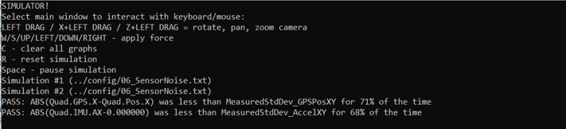
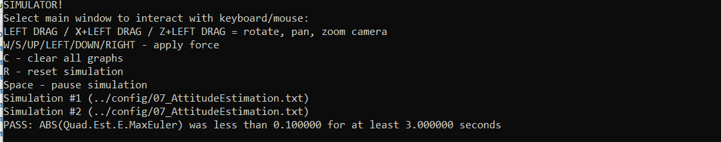
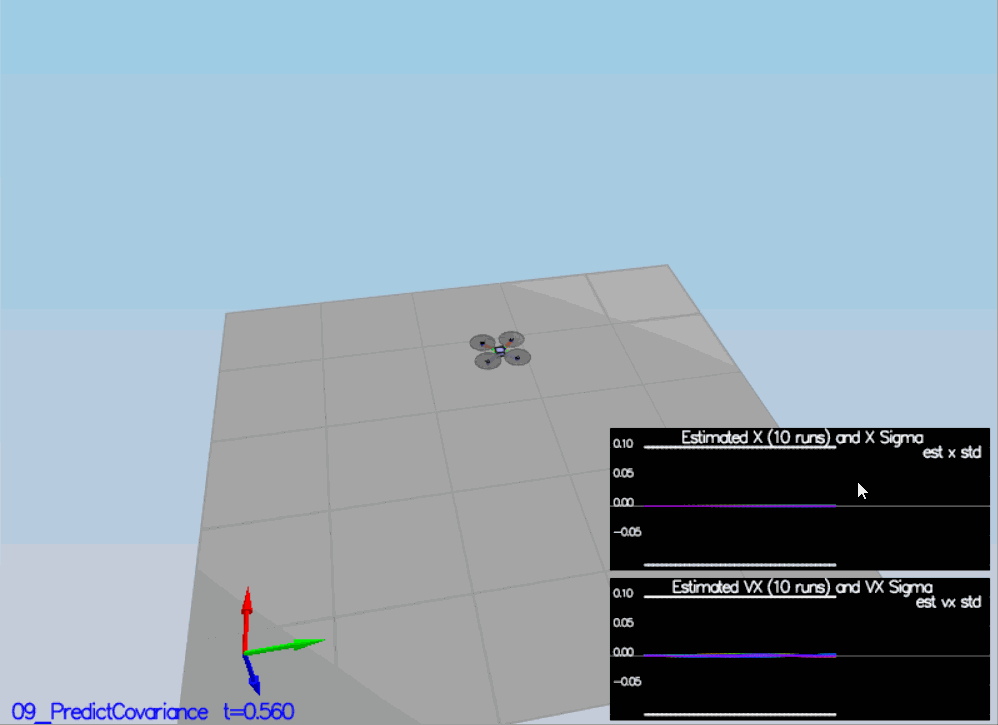
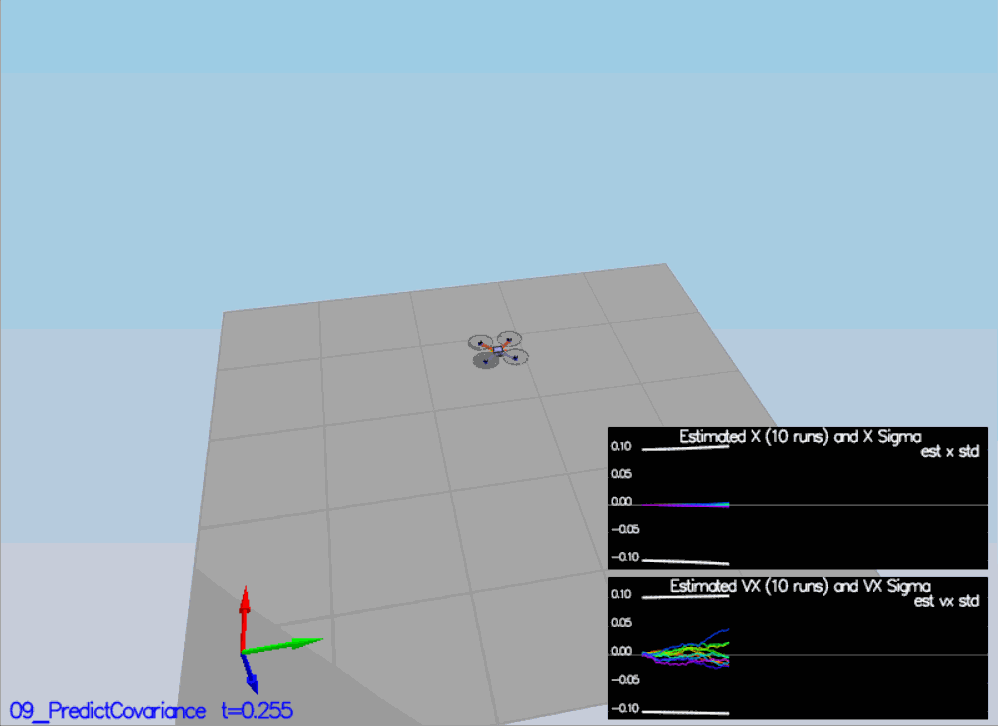
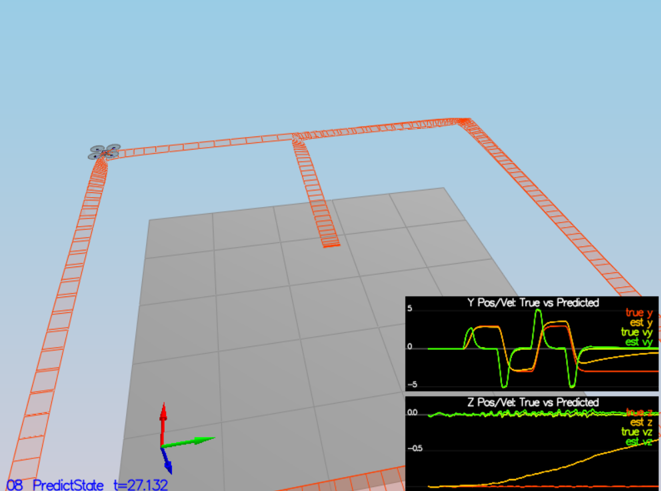
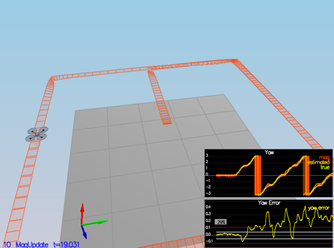
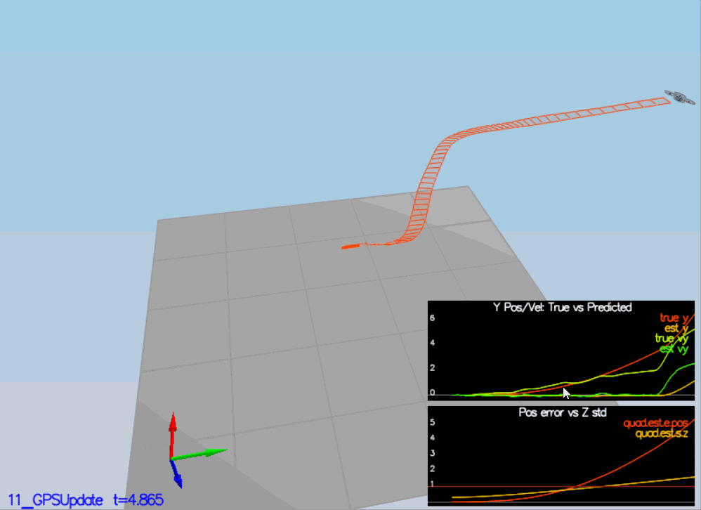

This WRITEUP aims to explain the different steps done to build the quadrotor estimator following the given tasks on README file.
For every task, there will be the modifications and test results.

## The tasks ##

### Step 1: Sensor Noise ###
In this task, we are asked to run the simulation scenario `06_NoisySensors` which will fill two config files: `config/log/Graph1.txt` with the GPS_X data and `config/log/Graph2.txt` with the accelometer X data. Then, we are asked to get the standard deviation of each config. To do that, I wrote a small piece of python code (available in `config/log/log_processing.py`).

The results after processing datas using the `log_processing.py` code are:
`GPS standard deviation = 0.7091878282995169`
`Accelerometer standard deviation = 0.4876120725700246`

We can now fill the two variable in `config/6_Sensornoise.txt` 
`MeasuredStdDev_GPSPosXY = 0.71`
`MeasuredStdDev_AccelXY = 0.49`

Using these values, the simulator returns PASS:

<p align="center">

</p>

### Step 2: Attitude Estimation ###
1. In this step, the pqr measurements from gyroscope in body coordinates was transformed to interia coordinates. The rotation matrix used in this transformation is given below:

<p align="center">

</p>

After implementing that in the function `UpdateFromIMU()` of the code `QuadEstimatorEKF.cpp`, the result is PASS:

<p align="center">

</p>

### Step 3: Prediction Step ###
1. After using the scenario `09_PredictCovariance` and implementing the function `GetRbgPrime()`, here is the output before implementing `Predict()` function:

<p align="center">

</p>

2. After implementing the `Predict()` function, here is the output:

<p align="center">

</p>

3. In this step, we are asked to implement the function `PredictState()` from the code `QuadEstimatorEKF.cpp`.When running the scenario `08_PredictState`, we can see the estimator state track the actual state, with only reasonably slow drift, as shown in the figure below:

<p align="center">

</p>

### Step 4: Magnetometer Update ###
1. The tuned value is: `QYawStd = 0.8`
2. After implementing the function `UpdateFromMag()`, here is the result on the simulator:

<p align="center">

</p>

### Step 5: Closed Loop + GPS Update ###
1. After launching the scenario `11_GPSUpdate`, here is the simulator output:

<p align="center">

</p>

2. After setting `Quad.UseIdealEstimator` to 0, here is the simulator output:

<p align="center">

</p>

3. After commenting these two lines:
```
#SimIMU.AccelStd = 0,0,0
#SimIMU.GyroStd = 0,0,0
```
here is the simulator result:

<p align="center">

</p>

4. After implementing the function `UpdateFromGPS()`, decommenting the two commented lines in step 5.3 and resetting the `Quad.UseIdealEstimator` to 1, here is the simulator output:

<p align="center">

</p>

### Step 6: Adding Your Controller ###
After adding the implemented controller from the controller project, here is the simulator output:

<p align="center">

</p>

The controller seems work and doen't need to retune its parameters.


